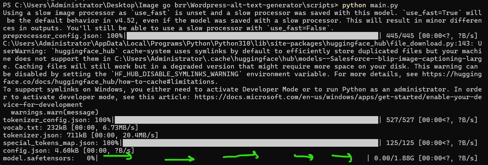

# Wordpress-alt-text-generator
When working with Wordpress, it can be a time-costly hassle to create alt-text for thousands of images manually. But with a simple python script, some insertable javascript, and a chrome extention, this can be done automatically! No hands! Runs on almost all systems! A huge timer saver.

#Only on windows

1. Check if you have python and pip installed.

Open up 'Windows powershell'

If you see a terminal like this, you are doing perfect!

Now type in 'python'

And hit enter

If you see something like this, move onto the next step. If you can't, no worries lets just test one more thing.

Lets now check for pip, go ahead and type it in.

If there are no errors and you see a bunch of commands, you are good to go! If not, i'll explain how we can get these on our system.

HOW TO INSTALL PYTHON

For windows visit this website
https://www.python.org/downloads/windows/

Should look like this

We are looking for "Download Windows installer (64-bit)"

Go ahead and click it, it'll download something. (make sure to download it to a place you'll remember)

find your file and run the file by double clicking it

After it opens, you should see this screen. Now here is the important part
Click "Add to path", this is what will allow us to run the script on the terminal

Cool, now you can click "Install Now"
It will ask for permissions, just click accept and make it happy

Keep clicking next until you see a finish screen.

Now open a new terminal and follow the steps above to check if 'python' works.

HOW TO INSTALL PIP

Now with python installed, its much easier to install pip

Go to your terminal and type in "python -m ensurepip --upgrade"

It should end with no errors

IF YOU ARE READY TO GO!

Go to the top of the repo page

Click on the green 'code' button, then on Local

Now download the zip

Locate the zip file and extract it all

Open it up and go inside the folder 'Wordpress-alt-text-generator'

Then go to the folder 'scripts'

If you see these 2 files, YOU ARE GOLDEN!!

The python file is a server that will run an AI model that creates Image captions.

For the Javascript file, you'll need to open it and copy and paste code into the web browser console. We'll get to that in a second.

For now, lets go back to the parent folder, and then right click the 'scripts' folder

We are going to click 'open in terminal'

Now you should see the terminal pulled up with our folder's path, Thats perfect

We can't just run the python file just yet, we need to install some dependences. That is why we have pip

Type in 'pip install flask request jsonify pillow transformers'

Also 'python -m pip install flask'

Perfect! We are ready to go.

Now we'll run the python server

Just type 'python main.py' and hit enter

You should see something like this now

We will need to wait for it to download some models, but when its done it should look like

Perfect! Now we can go to wordpress, make sure to have this running in the background

NOW ON WORDPRESS

Here is our wordpress admin site

We are going to go to the Media tab, then to the library tab

Here is all of our fun images, but we need to do 2 things first
1. filter the images
2. load all the images

Go to the top left corner and under 'All media items', select 'images'

Let it reload, now scroll down until you see this button

Keep clicking this button and scrolling down and loading more until you have loaded all the images

*This takes a second, but is vital

You should see something like this

OKAY, WE ARE SO CLOSE

Open up your dev console, you can also press "Ctrl + Shift + I"
Please use chrome.... Its so much better

You can see we have our console opened on the right-hand side.
We are going to be copy and pasting code into there very soon. 

We just have to install one extention that bypasses some security (don't worry, its all local)

Follow this link 
https://chromewebstore.google.com/detail/cors-unblock/hadoojkfknbjgoppkecpgamiajljiief?hl=en

Go ahead and click the blue button to add to chrome.

Now go back to our wordpress page, and click the puzzel peice icon in the upper right corner
*Mine looks different because I use OperaGX browser

We should see our extention, now click on it

You'll see this

Go ahead and enable it.

NICE, now we can use our javascript code.

Go back to our scripts folder

And open the script.js file to view it, we will need to copy and paste different parts in there.

I have it opened in the note text editor

Copy this first function, and paste it into the console on our wordpress website

Hit enter

Again for the second script

Hit enter

Now are you ready for the magic?

Here is the last thing.
Click on the first image in the library

You should see this now

You need to note 3 things.
The url
The Alternative text tab
and the "right arrow" button

The code only works when these 3 things are present.

If the alternative text tab is empty, it will create a new description.
Otherwise it will skip it if it already has something in it.

It will also skip it if the image does not render, and will leave a 'blank' in the text field

This code moves forward by clicking that right arrow button. When its finished, the right arrow button will grey out automatically.
From here you will need to turn off the code, as it will basically keep running itself into a wall. 

The descriptions are accurate enough!!
Just keep the tab open with the python server running, and it'll be finished in a jiffy.

Start:
runCaptioningLoop()

Stop:
stopCaptioning = true;

Have fun!!